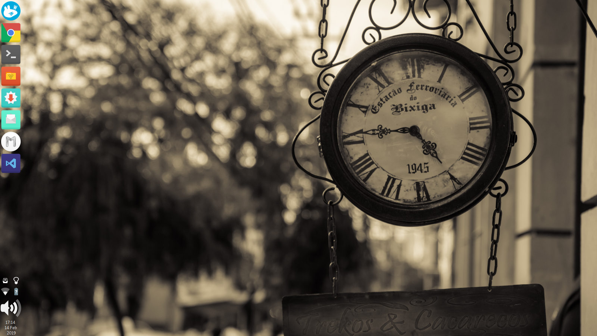

# XFCE4-taskbar-plugin
Modified plugin with larger icons. The code is definitely not perfect, but it works for me.

Clone repository
make
make install
xfce4-panel -r

Sometimes it will happen that the launcher doesn't work. This can be fixed by modifying ~/.config/xfce4/panel/taskbar/taskbar.rc

